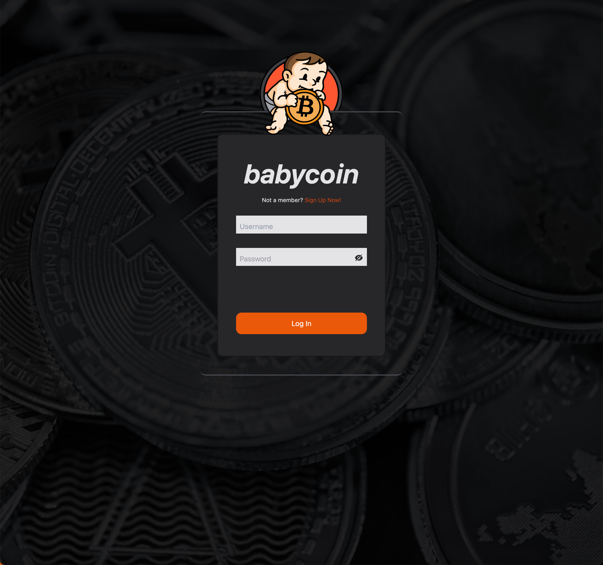
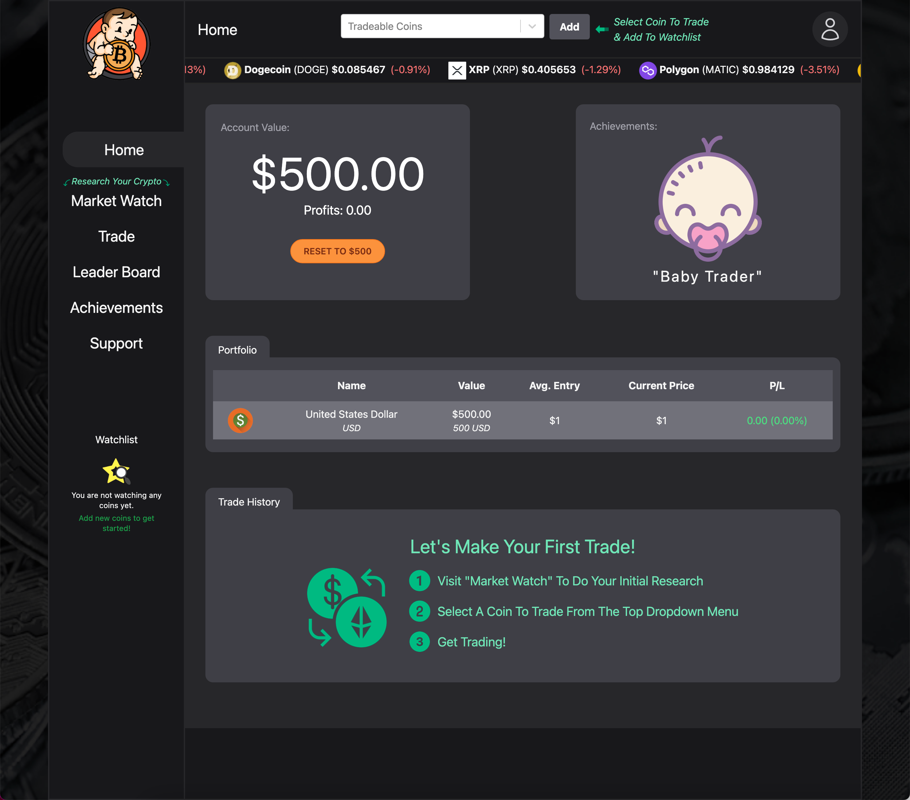
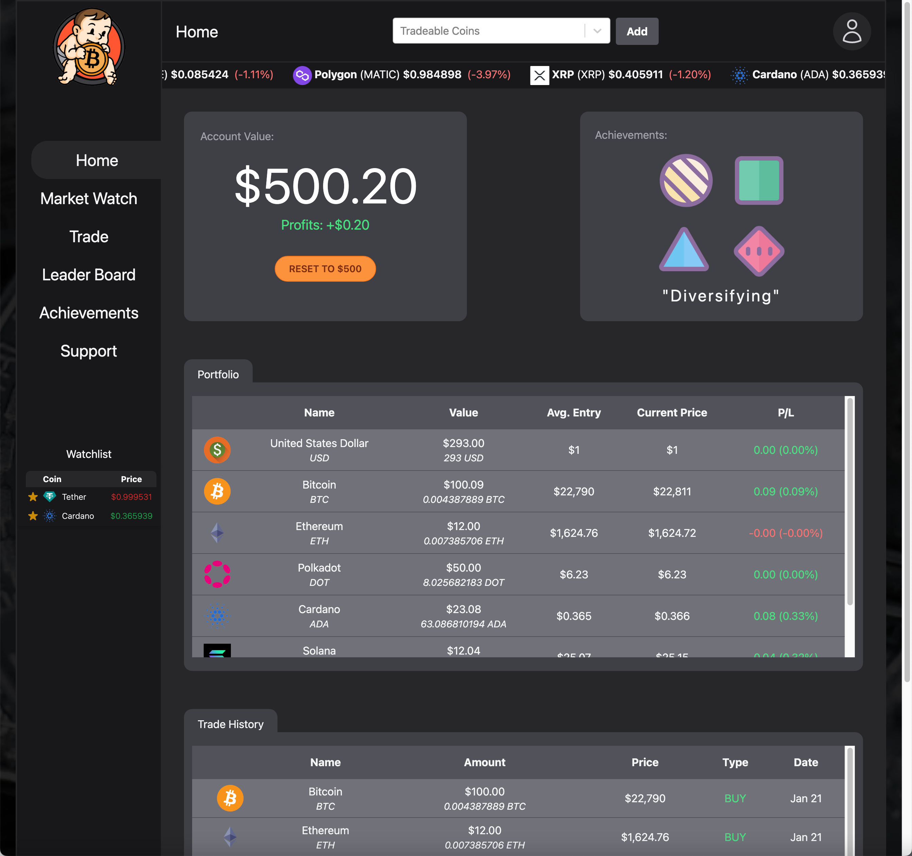
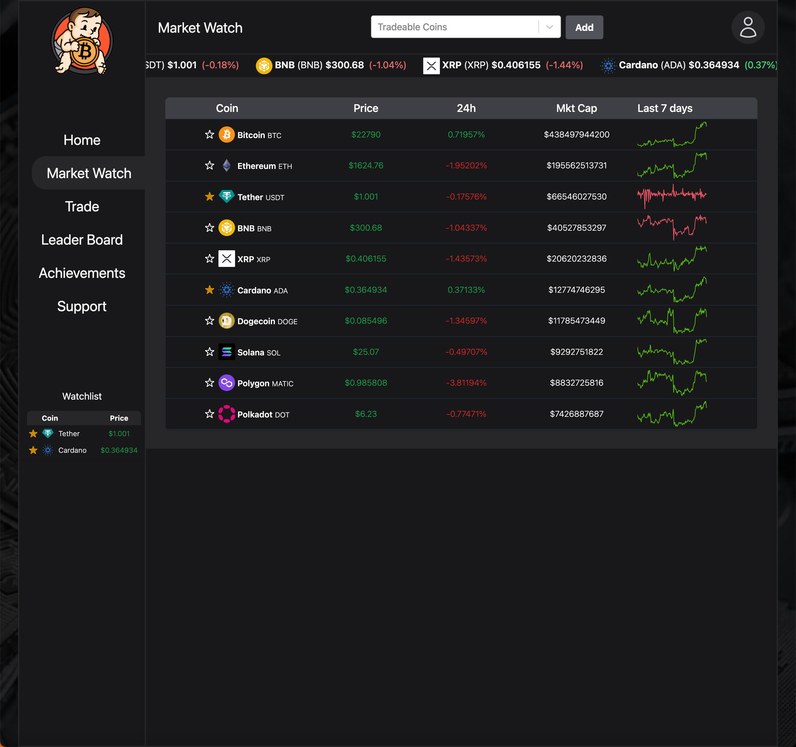
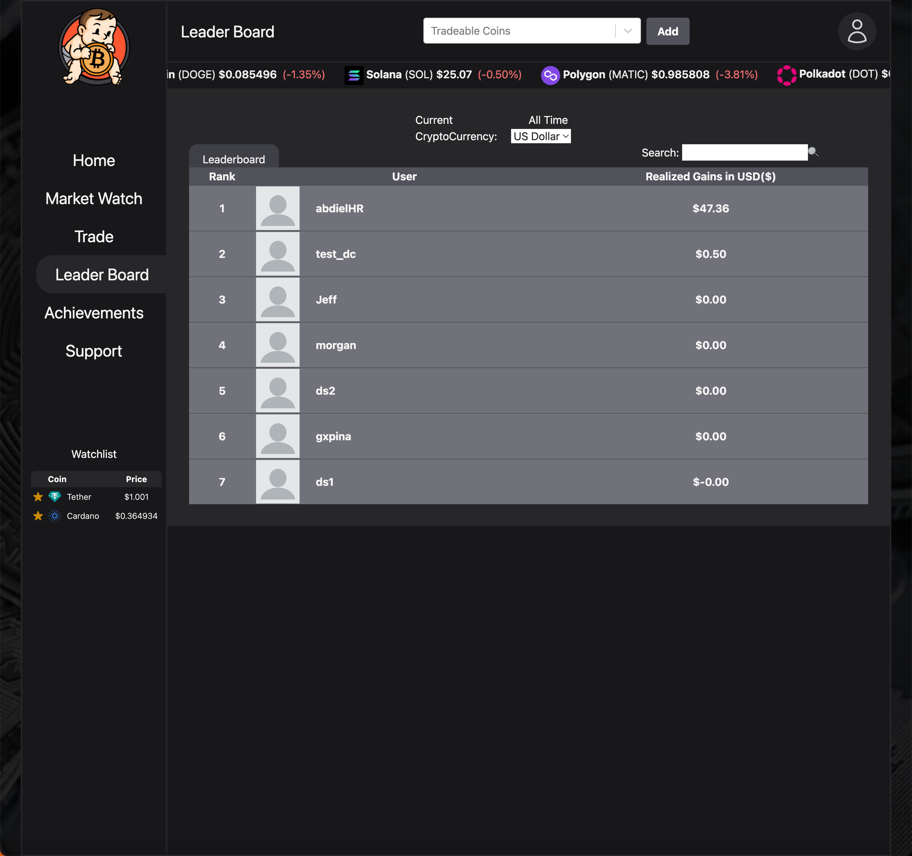

<h1 align="center">
   
  <b><i>babycoin</i></b>
</h1>
Welcome to *babycoin*, a platform that allows you to trade practice currency and experience the ups and downs of the market without risking any real money.

# Who is babycoin for?
*babycoin* is for anyone who is interested in learning about crypto trading, or for experienced traders who want a safe sandbox environment to test out new strategies.
 

  

# Features
1. **Sign In/Authentication:** Create/Signin user with email/password or Google Authentication.
2. **Crypto Portfolio:** Keep track of your holdings in various cryptocurrencies and view your overall portfolio performance.
3. **User Friendly Interface:** Simple an easy to follow directions for brand new users to get started trading fast with a good experience.
4. **Tracking different cryptocurrencies:** Stay up to date on the latest prices and market movements for the cryptocurrencies you are interested in.
5. **Graph view:** Visualize price trends over time with interactive graphs.
6. **Buying and selling crypto:** Use the platform to buy and sell cryptocurrencies with practice currency.
7. **Newsfeed:** Stay informed about the latest developments in the crypto market with our built-in newsfeed.
8. **Leaderboard for earnings:** See how you stack up against other traders on the leaderboard and compete for the top spot.
9. **Achievements:** Complete achievements to learn fundamental trading concepts and earn rewards.

  
  
  
  
  
  

# Why babycoin?
Many people are interested in learning about crypto trading, but it can be intimidating to start with real money. There is also a lack of educational resources for aspiring traders to learn the basics and improve their skills. 

*babycoin* solves this problem by providing a sandbox environment for traders to practice and learn in a low-risk setting. With our platform, you can trade with practice currency and complete achievements to learn fundamental trading concepts. You can also track your portfolio and compete with other traders on the leaderboard to see how you stack up.
>"At *babycoin*, our goal is to make it easy and safe for aspiring traders to learn and practice their skills," says Duke Syskey, CEO of babycoin.
# Getting Started
Getting started with *babycoin* is easy. Simply sign up for an account, fund it with practice currency, and start trading. You can track your progress and improve your skills as you go.
>"I've been using *babycoin* for a few months now and I've learned so much about crypto trading. It's a great way to practice without the pressure of real money," says Nick the Architect, a *babycoin* user.
# Support
If you have any questions or need assistance, please don't hesitate to reach out to our support team at support@babycoin.com.
# The Team
- Duke Romkey aka "*PortfolioUI_ProDuke*"
- Dongning Song aka "*MarketWatchlistWizardDongning*"
- Fiona Ren aka "*GraphGuruFiona*"
- Morgan Harrison aka "*BuySellBossMorgan*"
- Alex Yeung aka "*NewsNinjaAlex*"
- David Chiu aka "*LeaderboardMasterDavid*"
- Abdiel Sanchez aka "*AchievementAceAbdiel*"
- Nicholas Hays aka "*SecuritySpecialistNicholas*"
